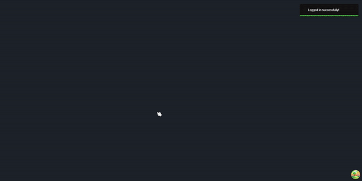
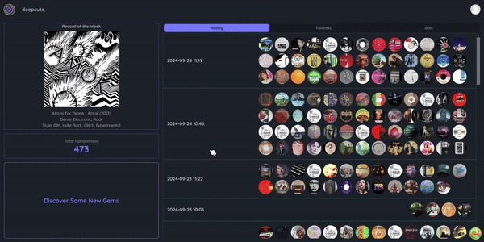
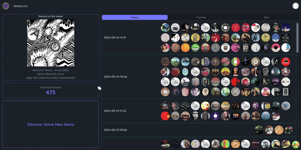
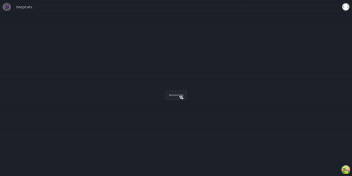
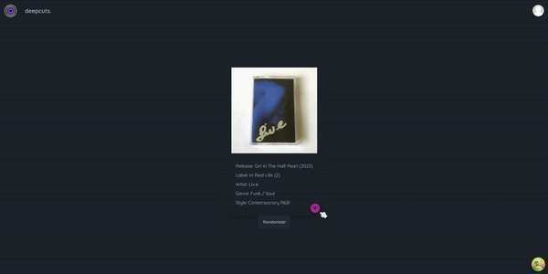

# **_deepcuts._**

This website will add functionality I feel was always missing from Discogs, a randomizer!  
Looking for the next obscure album or gem to uncover?  
Or maybe just trying to find that next record to play?  
Don't even know where to start?

Introducing **_deepcuts._**

> This randomizer works off all releases, not just the master release!  
> So even if a release does not have a master release, it will still populate here!

#### Future implementations include.......

> -   more randomizers based on MRIs/Artists/Labels,
> -   improved UI and optimized performance ,
> -   maybe Discogs account integration to be able to add to wantlist directly from here,
> -   and hopefully many more!

## How It Looks (so far)

1. Landing page is a screen where you can either create an account, or login with an existing one. The deepcuts button opens a modal that explains the purpose of deepcuts, as well as, crucial info needed before signing up!

> 

2. After logging in, it will automatically redirect you to the dashboard!

> 

3. Here on the left you will find my recommended Record of the Month, the total randomizes across all users, and the button to take you to the randomize page! On the right we have your personal History and Favorites!

> 

4. Clicking on the Discover button takes you to the page where the magic happens!

> 

5. On this page, clicking on the Randomize button will grab a random release from Discogs' catalog of over 31 million! On each click, the release is subsequently saved in your History!

> 

6. At any point during your search, you can click on the album artwork to be redirected to the official Discogs' page for that release (in a new tab). Once you find a record that piques your interest or you wish to save for later, you can click the heart icon to add it to your favorites!

> 

Built utilizing Next.js, Prisma ORM, Supabase for hosting the PostgreSQL database, and deployed on Vercel!

Thank you for joining me on this journey (:
